# 🐱 Neko Chain Blockchain

A minimal, educational blockchain implementation built with Node.js. This project demonstrates core cryptocurrency and P2P networking concepts in a clear, readable way.

**⚠️ This is NOT a production system. It's for learning only.**

## 🏗️ Architecture

```mermaid
graph TB
    subgraph Frontend["📱 Frontend (Next.js PWA)"]
        Wallet[Wallet UI]
        Send[Send Page]
        Mine[Mine Page]
        Explorer[Explorer]
    end

    subgraph Backend["🖥️ Backend Node"]
        API[Express API]
        BC[Blockchain]
        Storage[(LevelDB)]
        P2P[WebSocket P2P]
    end

    subgraph Network["🌐 P2P Network (WebSocket)"]
        Node1["Node 3000\nWS: 4000"]
        Node2["Node 3001\nWS: 4001"]
        Node3["Node 3002\nWS: 4002"]
    end

    Frontend -->|HTTP| API
    API --> BC
    BC --> Storage
    API --> P2P
    P2P <--> Node1
    P2P <--> Node2
    P2P <--> Node3
```



## ⛓️ Blockchain Structure


## 🔄 Transaction Flow

```mermaid
sequenceDiagram
    participant User
    participant API
    participant Blockchain
    participant P2P
    participant Peers

    User->>API: POST /transaction
    API->>Blockchain: Validate & Add
    Blockchain->>Blockchain: Check Balance
    Blockchain->>Blockchain: Verify Signature
    API->>P2P: Broadcast Transaction
    P2P->>Peers: Send to all peers
    API->>User: Transaction Added ✓
    
    Note over Blockchain: Transaction in Pending Pool
    
    User->>API: POST /mine
    API->>Blockchain: Mine Block (PoW)
    Blockchain->>Blockchain: Find Valid Hash
    API->>P2P: Broadcast Block
    P2P->>Peers: Send new block
    API->>User: Block Mined ✓
```



## 📁 Project Structure

```
neko-chain/
├── miner.js               # Auto-miner standalone script
├── explore-db.js          # LevelDB explorer utility
├── package.json
├── README.md
├── blockchain-data-*/     # LevelDB data (gitignored)
├── src/                   # Backend
│   ├── index.js           # Express API server
│   ├── blockchain.js      # Blockchain class (chain management)
│   ├── block.js           # Block class (mining, hashing)
│   ├── transaction.js     # Transaction class (signing)
│   ├── wallet.js          # Wallet utilities (key pairs)
│   ├── vm.js              # Smart Contract Virtual Machine
│   ├── contract.js        # Contract class and manager
│   ├── p2p.js             # HTTP P2P module (legacy)
│   ├── p2p-ws.js          # WebSocket P2P module (default)
│   └── storage.js         # LevelDB persistent storage
└── frontend/              # Next.js PWA wallet UI
    └── src/app/           # Pages (wallet, send, mine, explorer)
```

---

## 📜 Smart Contracts

Neko Chain includes a **stack-based Virtual Machine** for executing smart contracts.

### VM Architecture


### Opcodes

| Category | Opcodes |
|----------|--------|
| Stack | `PUSH`, `POP`, `DUP`, `SWAP` |
| Arithmetic | `ADD`, `SUB`, `MUL`, `DIV`, `MOD` |
| Comparison | `LT`, `GT`, `EQ`, `ISZERO` |
| Logic | `AND`, `OR`, `NOT` |
| Control | `JUMP`, `JUMPI`, `JUMPDEST`, `STOP` |
| Storage | `SLOAD`, `SSTORE` |
| System | `CALLER`, `CALLVALUE`, `RETURN`, `REVERT`, `LOG` |

### Deploy a Contract

```bash
# Using source code (simple language)
curl -X POST http://localhost:3000/contract/deploy \
  -H "Content-Type: application/json" \
  -d '{
    "deployer": "YOUR_PUBLIC_KEY",
    "source": "PUSH 100\nSTORE 0\nSTOP"
  }'
```

### Call a Contract

```bash
curl -X POST http://localhost:3000/contract/call \
  -H "Content-Type: application/json" \
  -d '{
    "contractAddress": "contract_abc123...",
    "caller": "YOUR_PUBLIC_KEY"
  }'
```

### Example: Counter Contract

```
// Store initial value 0
PUSH 0
STORE 0
STOP
```

### Smart Contract Endpoints

| Endpoint | Method | Description |
|----------|--------|-------------|
| `/contract/deploy` | POST | Deploy a contract |
| `/contract/call` | POST | Execute a contract |
| `/contract/:address` | GET | Get contract details |
| `/contracts` | GET | List all contracts |
| `/contract/compile` | POST | Compile source to bytecode |

---

## 🚀 Getting Started

### Prerequisites
- Node.js (v14 or higher)
- npm

### Installation

```bash
cd neko-coin
npm install
npm start
```

Backend runs at `http://localhost:3000`

### Running Frontend (Wallet UI)

```bash
cd frontend
npm install
npm run dev
```

Frontend runs at `http://localhost:8000`

### Running Multiple Nodes

```bash
# Terminal 1 - Main node (HTTP: 3000, WebSocket: 4000)
node src/index.js 3000

# Terminal 2 - Additional node (HTTP: 3001, WebSocket: 4001)
node src/index.js 3001

# Terminal 3 - Additional node (HTTP: 3002, WebSocket: 4002)
node src/index.js 3002
```

Nodes **auto-discover** each other via WebSocket and sync instantly!

---

## 📡 WebSocket P2P Networking

Real-time peer-to-peer communication using WebSockets.

### Ports

| HTTP Port | WebSocket Port |
|-----------|----------------|
| 3000 | 4000 |
| 3001 | 4001 |
| 3002 | 4002 |

### Message Types

| Message | Description |
|---------|-------------|
| `HANDSHAKE` | Initial connection, exchange chain length |
| `NEW_BLOCK` | Broadcast newly mined block |
| `NEW_TX` | Broadcast new transaction |
| `GET_CHAIN` | Request full blockchain |
| `CHAIN` | Send blockchain data |
| `PEERS` | Exchange peer lists |

### Features
- ⚡ **Real-time** - Instant block/transaction propagation
- 🔄 **Auto-sync** - Chains sync on connection
- 🔍 **Auto-discovery** - Finds peers from seed nodes
- 🔁 **Reconnection** - Automatically reconnects to lost peers

### Legacy HTTP Mode

```bash
# Use HTTP polling instead of WebSocket
node src/index.js 3000 --http-p2p
```

---

## ⛏️ Auto-Miner v2.0 (Multi-Node)

A standalone script that mines blocks on multiple nodes simultaneously.

### Quick Start

```bash
# Terminal 1+ : Start blockchain nodes
node src/index.js 3000
node src/index.js 3001

# Another Terminal - Start auto-miner
node miner.js
```

### Usage Options

```bash
# Auto-discover nodes and create new wallet
node miner.js

# Use existing wallet with auto-discovery
node miner.js YOUR_PUBLIC_KEY

# Connect to specific nodes
node miner.js YOUR_PUBLIC_KEY http://localhost:3000 http://localhost:3001
```

### Features
- 🔍 **Auto-Discovery** - Finds all active nodes automatically
- 📡 **Multi-Node** - Connects to all available nodes (default: 3000-3003)
- 🎯 **Smart Mining** - Mines on node with most pending transactions
- 🔄 **Auto-Refresh** - Refreshes node list every 10 attempts
- 💪 **Resilient** - Removes offline nodes, rediscovers when needed
- 🔑 Auto-creates wallet if not provided
- ⛏️ Mines blocks every 5 seconds
- 📊 Shows live stats (blocks mined, rewards, balance)
- 💰 Earns 50 NEKO per block

Press `Ctrl+C` to stop and see final statistics.

---

## 💾 LevelDB Storage

Blockchain data is persisted to disk using LevelDB (same as Bitcoin).

### Default Mode (Persistent)

```bash
node src/index.js 3000
# Data saved to: blockchain-data-3000/
```

### In-Memory Mode (Testing)

```bash
node src/index.js 3000 --memory
# Data lost on restart
```

### Features
- ✅ Blockchain survives server restarts
- ✅ Each node has its own database folder
- ✅ Pending transactions are persisted
- ✅ Automatic genesis block on first run

---

## 📚 Educational Concepts

### 1. Hashing (SHA-256)

A hash function takes any input and produces a fixed-size output (256 bits). Same input always produces the same output. Any tiny change = completely different output.

```javascript
hash = SHA256(index + timestamp + transactions + previousHash + nonce)
```

### 2. Digital Signatures (ECDSA)

- Proves YOU authorized a transaction
- Only the private key owner can create valid signatures
- Anyone can verify with the public key

```javascript
signature = ECDSA.sign(transactionHash, privateKey)
isValid = ECDSA.verify(transactionHash, signature, publicKey)
```

### 3. Mining (Proof of Work)

Find a "nonce" that makes the hash start with zeros:

```
Target: Hash must start with "0000"
Attempt 847293: nonce=847293 → hash="0000abc..."  ✅ FOUND!
```

### 4. Balance Calculation

Balances are NOT stored. They're calculated by scanning ALL transactions:

```
for each transaction:
    if you're receiver: balance += amount
    if you're sender:   balance -= amount
```

### 5. P2P Networking

- Nodes connect and share transactions/blocks
- "Longest chain wins" resolves conflicts
- Decentralized: no single point of failure

---

## 🔌 API Reference

### Core Endpoints

| Method | Endpoint | Description |
|--------|----------|-------------|
| POST | `/wallet/create` | Create new wallet |
| POST | `/transaction` | Send coins (returns txHash) |
| GET | `/transaction/status/:hash` | Check transaction status |
| POST | `/mine` | Mine pending transactions |
| GET | `/chain` | View blockchain |
| GET | `/balance/:address` | Check balance |
| GET | `/pending` | View pending transactions |
| GET | `/validate` | Validate chain integrity |

### P2P Endpoints

| Method | Endpoint | Description |
|--------|----------|-------------|
| GET | `/peers` | List connected peers |
| POST | `/peers/connect` | Connect to a peer node |
| POST | `/sync` | Sync chain with peers |

### Seed Node Management

| Method | Endpoint | Description |
|--------|----------|-------------|
| GET | `/seeds` | List all seed nodes |
| POST | `/seeds/add` | Add a seed node dynamically |
| POST | `/seeds/remove` | Remove a seed node |

---

## 🎮 Example Workflow (curl)

### Step 1: Create Wallets

```bash
# Create Alice's wallet
curl -X POST http://localhost:3000/wallet/create

# Response:
# {
#   "publicKey": "04a1b2c3...",
#   "privateKey": "abc123..."
# }

# Create Bob's wallet
curl -X POST http://localhost:3000/wallet/create
```

### Step 2: Mine Coins for Alice

```bash
curl -X POST http://localhost:3000/mine \
  -H "Content-Type: application/json" \
  -d '{"minerAddress": "ALICE_PUBLIC_KEY"}'
```

### Step 3: Send Coins to Bob

```bash
curl -X POST http://localhost:3000/transaction \
  -H "Content-Type: application/json" \
  -d '{
    "senderPrivateKey": "ALICE_PRIVATE_KEY",
    "receiverAddress": "BOB_PUBLIC_KEY",
    "amount": 25
  }'
```

### Step 4: Mine to Confirm Transaction

```bash
curl -X POST http://localhost:3000/mine \
  -H "Content-Type: application/json" \
  -d '{"minerAddress": "ALICE_PUBLIC_KEY"}'
```

### Step 5: Check Balances

```bash
# Check Alice's balance
curl http://localhost:3000/balance/ALICE_PUBLIC_KEY

# Check Bob's balance
curl http://localhost:3000/balance/BOB_PUBLIC_KEY
```

### Step 6: View Blockchain

```bash
curl http://localhost:3000/chain
```

### Step 7: Validate Chain

```bash
curl http://localhost:3000/validate
```

---

## 📡 P2P Network (Multi-Node)

### Connect Nodes

```bash
# Start 3 nodes in separate terminals first

# Connect Node 1 to Node 2
curl -X POST http://localhost:3000/peers/connect \
  -H "Content-Type: application/json" \
  -d '{"peerUrl": "http://localhost:3001"}'

# Connect Node 1 to Node 3
curl -X POST http://localhost:3000/peers/connect \
  -H "Content-Type: application/json" \
  -d '{"peerUrl": "http://localhost:3002"}'
```

### List Peers

```bash
curl http://localhost:3000/peers
```

### Sync Chain with Peers

```bash
# Sync Node 2 with peers (gets longest valid chain)
curl -X POST http://localhost:3001/sync

# Sync Node 3 with peers
curl -X POST http://localhost:3002/sync
```

### View Stats

```bash
curl http://localhost:3000/stats
```

---

## ⚙️ Configuration

Edit these values in `blockchain.js`:

```javascript
this.difficulty = 4;      // More zeros = harder mining
this.miningReward = 50;   // Coins per mined block
```

---

## 🤔 FAQ

**Q: Why is mining slow?**
A: Proof of Work requires computation. Difficulty=4 means hash must start with "0000".

**Q: How does P2P sync work?**
A: Nodes use "longest valid chain wins". When you call `/sync`, it replaces your chain with the longest valid one from peers.

**Q: Can transactions be forged?**
A: No. Each transaction is signed with the sender's private key. Without it, the signature will be invalid.

---

## 🚀 Production Roadmap

This is an **educational project**. For production use, you would need:

### 🔐 Security

| Feature | Current | Production Needed | Why? |
|---------|---------|-------------------|------|
| Data Storage | ✅ **LevelDB** | - | Fast key-value store used by Bitcoin; data survives restarts |
| Private Keys | localStorage | Hardware wallet / encrypted keystore | localStorage is readable by any JS; easily stolen |
| API Authentication | None | JWT tokens, rate limiting | Prevent unauthorized access and spam attacks |
| HTTPS | No | Yes, with SSL certificates | Prevent man-in-the-middle attacks on transactions |
| Input Validation | Basic | Comprehensive sanitization | Prevent injection attacks and malformed data |

### 🌐 Networking

| Feature | Current | Production Needed | Why? |
|---------|---------|-------------------|------|
| P2P Protocol | ✅ **WebSockets** | - | Real-time instant propagation of blocks and transactions |
| Peer Discovery | Seed nodes | DHT / DNS seeds | Decentralized discovery; seed nodes are single point of failure |
| Node Communication | Unencrypted | TLS encryption (WSS) | Prevent eavesdropping on transaction data |
| DDoS Protection | None | Rate limiting, PoW challenges | Attackers can flood network and halt operations |

### ⚡ Performance

| Feature | Current | Production Needed | Why? |
|---------|---------|-------------------|------|
| Transaction Pool | Array | Priority queue with fees | Miners should prioritize higher-fee transactions |
| Block Size | Unlimited | Block size limits | Prevent bloated blocks that slow down network |
| Mempool | No limit | Size limit with eviction | Prevent memory exhaustion; remove stale transactions |
| UTXO Model | Balance scan | UTXO set with merkle proofs | O(1) validation vs O(n) scanning entire chain |

### 📊 Features to Add

| Feature | Why Needed? |
|---------|-------------|
| **Transaction Fees** | Incentivize miners when block rewards decrease |
| **Merkle Trees** | Verify transactions without downloading full blocks (SPV) |
| **SPV Clients** | Light wallets for mobile devices with limited storage |
| **Smart Contracts** | Programmable money for DeFi, NFTs, DAOs |
| **Multi-sig Wallets** | Require multiple approvals for large transactions |
| **HD Wallets** | Generate many addresses from one seed phrase |
| **Difficulty Adjustment** | Keep block time consistent as hashrate changes |
| **Halving Events** | Control inflation; create scarcity over time |

### 🧪 Testing

| Test Type | Why Needed? |
|-----------|-------------|
| Unit tests | Catch bugs in individual functions before deployment |
| Integration tests | Ensure P2P, mining, and transactions work together |
| Load testing | Verify network handles high transaction volume |
| Security audits | Professional review to find vulnerabilities |
| Formal verification | Mathematical proof that consensus is correct |

---

## 💱 Exchange NEKO for Other Cryptocurrencies

Once Neko Chain is production-ready, users can exchange NEKO for Bitcoin or other cryptocurrencies through several methods:

### 1. Centralized Exchange (CEX)

Like Binance, Coinbase, Kraken.

```
User deposits NEKO → Exchange → Trades NEKO for BTC → Withdraws BTC
```

| Pros | Cons |
|------|------|
| Easy to use | Requires KYC |
| High liquidity | Custody risk |
| Fiat on-ramp | Listing fees expensive |

### 2. Decentralized Exchange (DEX)

Like Uniswap, PancakeSwap, SushiSwap.

```
User connects wallet → DEX → Swaps NEKO for BTC (wrapped)
```

| Pros | Cons |
|------|------|
| No KYC | Need wrapped tokens |
| Self-custody | Requires liquidity |
| Permissionless | Smart contract risk |

**Requirements for DEX:**
- Deploy NEKO as ERC-20 on Ethereum (or similar)
- Provide initial liquidity pool (NEKO/ETH or NEKO/WBTC)

### 3. Atomic Swaps (Direct P2P)

Trustless cross-chain swaps using Hash Time-Locked Contracts (HTLC).

```
Alice (NEKO) ←→ HTLC ←→ Bob (BTC)
```

| Pros | Cons |
|------|------|
| Fully trustless | Complex implementation |
| No intermediary | Both chains need HTLC support |
| Direct swap | Limited liquidity |

### 4. Bridge to Major Chains

Create wrapped version of NEKO on Ethereum/BSC.


### Production Roadmap for Exchange

| Step | Action |
|------|--------|
| 1 | Deploy NEKO as ERC-20 token |
| 2 | Create bridge contract |
| 3 | Add liquidity on Uniswap/SushiSwap |
| 4 | Apply for CEX listings |
| 5 | Implement atomic swaps (advanced) |

---

## 📖 Further Reading

- [Bitcoin Whitepaper](https://bitcoin.org/bitcoin.pdf)
- [How Bitcoin Works (YouTube)](https://www.youtube.com/watch?v=bBC-nXj3Ng4)
- [SHA-256 Explained](https://en.wikipedia.org/wiki/SHA-2)
- [ECDSA Cryptography](https://en.wikipedia.org/wiki/Elliptic-curve_cryptography)
- [Building a Blockchain (Naivecoin)](https://lhartikk.github.io/)
- [libp2p Documentation](https://docs.libp2p.io/)
- [Atomic Swaps Explained](https://academy.binance.com/en/articles/atomic-swaps-explained)
- [How DEXs Work](https://ethereum.org/en/defi/)

---

*Made with 🐱 for educational purposes*


